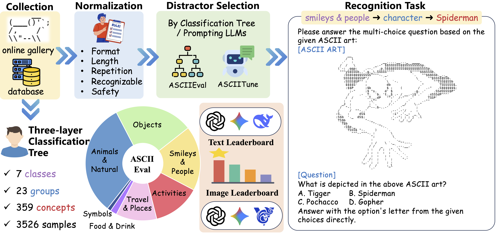

<div align= "center">
    <h1> Visual Perception in Text Strings </h1>
</div>

<div align= "center">
<p>
<a href="https://arxiv.org/abs/2410.01733v2">📖 Arxiv</a> |
<a href="https://huggingface.co/datasets/ASCIIEval/ASCIIEval">🤗 ASCIIEval Dataset</a> |
<a href="https://huggingface.co/datasets/ASCIIEval/ASCIITune">🤗 ASCIITune Dataset</a>
<!-- <a href="https://asciieval.github.io/">🌐 Website</a>  -->
</p>
</div>

[toc]

# Introduction

Perceiving visual semantics embedded within consecutive characters is a crucial yet under-explored capability for both Large Language Models (LLMs) and Multi-modal Large Language Models (MLLMs). In this work, we select ASCII art as a representative artifact. It depicts concepts through careful arrangement of characters, which can be formulated in both text and image modalities. We frame the problem as a recognition task, and construct a novel benchmark, ASCIIEval. It covers over 3K samples with an elaborate categorization tree, along with a training set for further enhancement. Encompassing a comprehensive analysis of tens of models through different input modalities, our benchmark demonstrate its multi-faceted diagnostic power. 


<h1 align="center">

<br>
</h1>


## Installation

Clone this repo into your working directory and setup the environment:

```python
git clone https://github.com/JiaQiSJTU/VisionInText
cd VisionInText
conda create -n ascii python=3.10
conda activate ascii
pip install -r requirements.txt
```

Major requirements are listed in `requirements.txt`. The specific version of these packages may be varied based on the specific LLMs or MLLMs to be trained or evaluated.


## Data

We express our gratitude to the ASCII artists whose fantastic creations underpin our research. In order to assess the visual perception abilities of models, we made slight modifications to the original ASCII art for the test set ASCIIEval. Meanwhile, we retained the original ASCII art (`original_ascii_art`) and provided the URL (`url`) to the data source. It is important to note that our data is licensed under CC BY NC 4.0, which permits only non-commercial use and is intended exclusively for research purposes.

Some examplified training (ASCIITune) and test data (ASCIIEval) are provided in `./data`. 

To begin with, please collect the images for each ASCII art by:
```python
bash script/prepare_data.sh
```

Here are descriptions for some important properties of each sample:
* `url`: the source webpage.
* `ascii_art`: the text string of the ASCII art.
* `category-1/2/3`: the class/group/concept depicted in the ASCII art.
* `choices`: the positive and negative choices for the ascii art recognition task.
* `labels`: the corresponding label for each choice.
* `image_path`: the path to the image modality of the ASCII art.

Statistics of ASCIIEval and ASCIITune are as follows:
<table><thead>
  <tr>
    <th></th>
    <th>#Samples</th>
    <th>#Concepts</th>
    <th>#Characters<br>(Min / Max / Avg)</th>
    <th>#Lines<br>(Min / Max / Avg)</th>
  </tr></thead>
<tbody>
  <tr>
    <td>ASCIIEval</td>
    <td>3,526</td>
    <td>359</td>
    <td>4 / 15,282 / 63,553</td>
    <td>1 / 100 / 16.97</td>
  </tr>
  <tr>
    <td>ASCIITune</td>
    <td>11,836</td>
    <td>2,307</td>
    <td>1 / 13,569 / 62,238</td>
    <td>1 / 97 / 15.22</td>
  </tr>
</tbody>
</table>


## Evaluation

To evaluate LLMs on ASCIIEval locally:
```bash
CUDA_VISIBLE_DEVICES=xxx python3 src/evaluation.py --model_dir /path/to/the/model --output_file_path xxx.jsonl

```

To evaluate MLLMs on ASCIIEval locally:
```bash
CUDA_VISIBLE_DEVICES=xxx python3 src/evaluation_mm.py --model_dir /path/to/the/model --output_file_path xxx.jsonl --mode both
```
`mode` determines the input modality for MLLMs, including `text-only`, `image-only`, `both`.

To evaluate models through API:
```bash
export API_KEY=xxx
python3 src/evaluation_by_api.py --api_key $API_KEY --model_name xxx --base_url https://xxxxxxxx/v1 --output_file_path xxx.jsonl --mode text-only
```

## Fine-tuning

To fine-tune an LLM on ASCIITune:
```bash
bash script/train_LLM.sh 
bash script/train_LLM_w_rational.sh
```

To fine-tune an MLLM on ASCIITune:
```bash
bash script/train_MLLM.sh
```
Here, `mode` represents different input modality setting, including `text-only`, `image-only`, `both` and `random`.


# Leaderboard for Textual Input

**LLMs demonstrate the ability to comprehend visual information solely from textual input.** For textual input, proprietary models exhibit the ability for recognizing ASCII art concepts with over 70% accuracy on certain categories, but open-source LLMs lags far behind. We propose rationale-assisted fine-tuning to bridge this gap, which elevates the open-source LLMs performance relatively by 26.10%. 


| Rank | Model | Score | Open-Source | Company | Release Year |
| :---: | :--- | :---: | :---: | :--- | :---: |
| 1 | GPT-5 | **55.90** | No | OpenAI | 2025 |
| 2 | Gemini-2.5-pro | 50.65 | No | Google | 2025 |
| 3 | GPT-4o | 43.40 | No | OpenAI | 2024 |
| 4 | DeepSeek-V3 | 35.94 | Yes | DeepSeek | 2025 |
| 5 | Gemma-3-27B | 35.65 | Yes | Google | 2025 |
| 6 | Gemini-1.5-pro | 33.49 | No | Google | 2024 |
| 7 | Qwen2.5-72B | 33.20 | Yes | Alibaba | 2024 |
| 8 | Llama-3.3-70B | 32.74 | Yes | Meta | 2024 |
| 9 | Gemma-2-27B | 32.36 | Yes | Google | 2024 |
| 10 | Llama-3.1-405B | 32.31 | Yes | Meta | 2024 |
| 11 | Claude-opus-4 | 31.29 | No | Anthropic | 2025 |
| 12 | Llama-3.1-70B | 31.27 | Yes | Meta | 2024 |
| 13 | Qwen2.5-32B | 31.65 | Yes | Alibaba | 2024 |
| 14 | Qwen3-14B | 30.79 | Yes | Alibaba | 2025 |
| 15 | Qwen2-72B | 30.73 | Yes | Alibaba | 2024 |
| 16 | Gemma-2-9B | 30.50 | Yes | Google | 2024 |
| 17 | Llama-3-70B | 30.42 | Yes | Meta | 2024 |
| 18 | Qwen1.5-110B | 30.28 | Yes | Alibaba | 2024 |
| 19 | Qwen3-32B | 30.18 | Yes | Alibaba | 2025 |
| 20 | Gemma-3-12B | 29.29 | Yes | Google | 2025 |
| 21 | Qwen2.5-14B | 29.14 | Yes | Alibaba | 2024 |
| 22 | Llama-3-8B | 28.71 | Yes | Meta | 2024 |
| 23 | Qwen3-8B | 28.28 | Yes | Alibaba | 2025 |
| 24 | Mixtral-8x22B-v0.1 | 28.20 | Yes | Mistral AI | 2024 |
| 25 | Llama-2-70B | 28.08 | Yes | Meta | 2023 |
| 26 | Qwen2-7B | 27.71 | Yes | Alibaba | 2024 |
| 27 | Qwen2.5-7B | 27.57 | Yes | Alibaba | 2024 |
| 28 | Gemma-3-4B | 27.34 | Yes | Google | 2025 |
| 29 | Llama-3.1-8B | 27.22 | Yes | Meta | 2024 |
| 30 | Mistral-7B-v0.1 | 26.88 | Yes | Mistral AI | 2023 |
| 31 | Qwen1.5-7B | 26.71 | Yes | Alibaba | 2024 |
| 32 | Mistral-7B-v0.2 | 26.28 | Yes | Mistral AI | 2023 |
| 33 | Llama-2-13B | 25.93 | Yes | Meta | 2023 |
| 34 | Mistral-7B-v0.3 | 25.57 | Yes | Mistral AI | 2024 |
| 35 | Mixtral-8x7B-v0.1 | 25.31 | Yes | Mistral AI | 2023 |
| 36 | Llama-2-7B | 24.59 | Yes | Meta | 2023 |
| 37 | Qwen-7B | 23.30 | Yes | Alibaba | 2023 |


# Leaderboard for Image Input

**MLLMs exhibit limited visual generalization capabilities, and reveal a seesaw effect between their OCR and ASCII art recognition performance.** For image inputs, we reveal that the latest open-source MLLMs over-emphasize fine-grained text recognition at the expense of perceiving collective visual information, leading to the dramatic gap of over 37% accuracy compared with GPT-5. To address this, we introduce a test-time, low-resolution prompting strategy and a vision-focused fine-tuning approach to activate models' perception ability.


| Rank | Model | Score | Open-Source| Company | Release Year |
| :---: | :--- | :---: | :---: | :--- | :---: |
| 1 | GPT-5 | 87.81 | No | OpenAI | 2025 |
| 2 | Gemini-2.5-pro | 83.07 | No | Google | 2025 |
| 3 | GPT-4o | 82.62 | No | OpenAI | 2024 |
| 4 | CogVLM2-Llama3-19B | 67.80 | Yes | THUDM | 2025 |
| 5 | LLaVA-v1.6-34B | 65.66 | Yes | LLaVA | 2024 |
| 6 | LLaVA-v1.5-7B | 62.18 | Yes | LLaVA | 2023 |
| 7 | LLaVA-v1.5-13B | 61.87 | Yes | LLaVA | 2023 |
| 8 | CogVLM-17B | 61.00 | Yes | THUDM | 2023 |
| 9 | LLaVA-v1.6-mistral-7B | 60.72 | Yes | LLaVA | 2024 |
| 10 | Gemini-1.5-pro | 60.69 | No | Google | 2024 |
| 11 | LLaVA-v1.6-vicuna-13B | 59.70 | Yes | LLaVA | 2024 |
| 12 | Qwen-VL | 52.32 | Yes | Alibaba | 2023 |
| 13 | InternVL3-38B | 50.27 | Yes | Shanghai AI Lab | 2025 |
| 14 | InternVL3-78B | 48.33 | Yes | Shanghai AI Lab | 2025 |
| 15 | Claude-opus-4 | 40.41 | No | Anthropic | 2024 |
| 16 | Qwen2.5-VL-72B | 36.42 | Yes | Alibaba | 2025 |
| 17 | Qwen2.5-VL-7B | 34.83 | Yes | Alibaba | 2025 |
| 18 | InternVL3-14B | 33.25 | Yes | Shanghai AI Lab | 2025 |
| 19 | InternVL3-8B | 32.74 | Yes | Shanghai AI Lab | 2025 |
| 20 | Qwen2.5-VL-32B | 29.35 | Yes | Alibaba | 2025 |


# Leaderboard for Average Cross-Modality Performance

**The inability to dynamically integrate congruent cross-modal signals impedes current models.** Another critical finding is that model performance is sensitive to the length of the ASCII art, with this sensitivity varying across input modalities. Unfortunately, none of the models could successfully benefit from the simultaneous provision of both modalities, highlighting the need for more flexible modality-fusion approaches.

| Rank | Model | Text-only | Image-only | Text-Image | Average |
| :---: | :--- | :---: | :---: | :---: | :---: |
| 1 | GPT-5 | 55.90 | 87.81 | 86.40 | 76.70 |
| 2 | Gemini-2.5-pro | 50.65 | 83.07 | 81.64 | 71.79 |
| 3 | GPT-4o | 43.40 | 82.62 | 75.41 | 67.14 |
| 4 | CogVLM2-Llama3-19B | 24.73 | 67.80 | 66.68 | 53.07 |
| 5 | Llava-v1.6-34B | 28.62 | 65.66 | 61.33 | 51.87 |
| 6 | Gemini-1.5-pro | 33.49 | 60.69 | 58.33 | 50.84 |
| 7 | Llava-v1.5-13B | 26.00 | 61.87 | 60.70 | 49.52 |
| 8 | Llava-v1.5-7B | 24.66 | 62.18 | 61.52 | 49.45 |
| 9 | Llava-v1.6-mistral-7B | 25.89 | 60.72 | 59.02 | 48.54 |
| 10 | Llava-v1.6-vicuna-13B | 26.03 | 59.70 | 56.55 | 47.43 |
| 11 | CogVLM-17B | 21.25 | 61.00 | 57.58 | 46.61 |
| 12 | InternVL3-78B | 33.55 | 48.33 | 48.54 | 43.37 |
| 13 | InternVL3-38B | 32.10 | 50.27 | 47.28 | 43.22 |
| 14 | Qwen-VL | 24.79 | 52.32 | 40.09 | 39.07 |
| 15 | Qwen2.5-VL-72B | 34.20 | 36.42 | 37.82 | 36.15 |
| 16 | Claude-opus-4 | 31.29 | 40.41 | 36.68 | 36.13 |
| 17 | Qwen2.5-VL-7B | 25.05 | 34.83 | 37.01 | 32.30 |
| 18 | InternVL3-8B | 27.30 | 32.74 | 33.58 | 31.21 |
| 19 | Qwen2.5-VL-32B | 29.82 | 29.35 | 32.07 | 30.41 |
| 20 | InternVL3-14B | 25.91 | 33.25 | 31.50 | 30.22 |


## Citation

```
@misc{jia2025asciieval,
      title={ASCIIEval: Benchmarking Models' Visual Perception in Text Strings via ASCII Art}, 
      author={Qi Jia and Xiang Yue and Shanshan Huang and Ziheng Qin and Yizhu Liu and Bill Yuchen Lin and Yang You and Guangtao Zhai},
      year={2025},
      eprint={2410.01733},
      archivePrefix={arXiv}
}
```