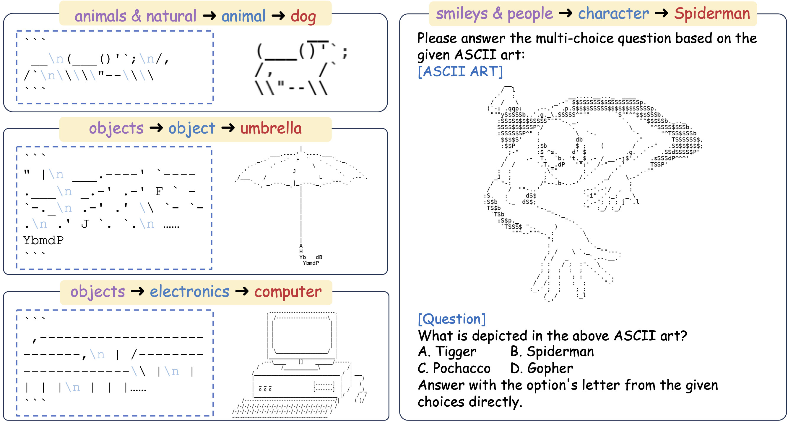

<div align= "center">
    <h1> Visual Perception in Text Strings </h1>
</div>

<div align= "center">
<p>
<a href="https://arxiv.org/abs/2410.01733">📖 Arxiv</a> |
<!-- <a href="https://huggingface.co/datasets">🤗 Dataset</a> | -->
<!-- <a href="https://asciieval.github.io/">🌐 Website</a>  -->
</p>
</div>

Understanding visual semantics embedded in consecutive characters is a crucial capability for both large language models (LLMs) and multi-modal large language models (MLLMs). This type of artifact possesses the unique characteristic that identical information can be readily formulated in both texts and images, making them a significant proxy for analyzing how capable modern LLMs and MLLMs are in modality-agnostic vision understanding. In this project, we select ASCII art as a representative artifact, where the lines and brightness used to depict each concept are rendered by characters, and we frame the problem as an ASCII art recognition task. The data and codes for fine-tuning and evaluating models' performance are presented in this repository.

<h1 align="center">

<br>
</h1>

## Motivation

For *LLMs*:
* Language models are **capable** of encoding visual information through escape characters, such as "\n" and "\t".
* Visual information is **ubiquitous** in a wide range of text processing tasks, such as
processing tabular data and playing board games.
* Using visual information reflected in characters to break through the defense line is becoming a threat to LLM **safety** issues. Better understanding LLMs' visual perception ability to make proactive defense is in urgent need.

For *MLLMs*:
* A new perspective of understanding MLLMs visual perception ability and the degree of modality fusion.
*  MLLMs are expected to perform **robustly among different modalities**, when visual information in different modalities is provided individually. 
*  MLLMs are expected to **take the best of both worlds** when two modalities are presented simultaneously and demonstrate stronger vision understanding ability.


***Note that this repository is still under construction, please stay tuned for further update.***

## Installation

Clone this repo into your working directory and setup the environment:

```python
git clone https://github.com/JiaQiSJTU/VisionInText.git
cd ASCIIEval
conda create -n ascii python=3.10
conda activate ascii
pip install -r requirements.txt
```

Major requirements are listed in `requirements.txt`. The specific version of these packages may be varied based on the specific LLMs or MLLMs to be trained or evaluated.


## Data

We express our gratitude to the ASCII artists whose fantastic creations underpin our research. In order to assess the visual perception abilities of models, we made slight modifications to the original ASCII art for the test set ASCIIEval. Meanwhile, we retained the original ASCII art (`original_ascii_art`) and provided the URL (`url`) to the data source. It is important to note that our data is licensed under CC BY NC 4.0, which permits only non-commercial use and is intended exclusively for research purposes.

Some examplified training (ASCIITune) and test data (ASCIIEval) are provided in `./data`. 

To begin with, please collect the images for each ASCII art by:
```python
bash script/prepare_data.sh
```

Here are descriptions for some important properties of each sample:
* `url`: the source webpage.
* `ascii_art`: the text string of the ASCII art.
* `category-1/2/3`: the class/group/concept depicted in the ASCII art.
* `choices`: the positive and negative choices for the ascii art recognition task.
* `labels`: the corresponding label for each choice.
* `image_path`: the path to the image modality of the ASCII art.

Statistics of ASCIIEval and ASCIITune are as follows:
<table><thead>
  <tr>
    <th></th>
    <th>#Samples</th>
    <th>#Concepts</th>
    <th>#Characters<br>(Min / Max / Avg)</th>
    <th>#Lines<br>(Min / Max / Avg)</th>
  </tr></thead>
<tbody>
  <tr>
    <td>ASCIIEval</td>
    <td>3,526</td>
    <td>359</td>
    <td>4 / 15,282 / 63,553</td>
    <td>1 / 100 / 16.97</td>
  </tr>
  <tr>
    <td>ASCIITune</td>
    <td>11,836</td>
    <td>2,307</td>
    <td>1 / 13,569 / 62,238</td>
    <td>1 / 97 / 15.22</td>
  </tr>
</tbody>
</table>


## Evaluation

To evaluate LLMs on ASCIIEval locally:
```bash
CUDA_VISIBLE_DEVICES=xxx python3 src/evaluation.py --model_dir /path/to/the/model --model_template xxx --output_file_path xxx.jsonl

```

To evaluate MLLMs on ASCIIEval locally:
```bash
CUDA_VISIBLE_DEVICES=xxx python3 src/evaluation_mm.py --model_dir /path/to/the/model --output_file_path xxx.jsonl --mode both
```
`mode` determines the input modality for MLLMs, including `text-only`, `image-only`, `both`.

To evaluate models through API:
```bash
export API_KEY=xxx
python3 src/evaluation_by_api.py --api_key $API_KEY --model_name xxx --base_url https://xxxxxxxx/v1 --template_name xxx --output_file_path xxx.jsonl --mode text-only
```

## Fine-tuning

To fine-tune an LLM on ASCIITune:
```bash
bash script/train_LLM.sh 
```

To fine-tune an MLLM on ASCIITune:
```bash
bash script/train_MLLM.sh
```
Here, `mode` represents different input modality setting, including `text-only`, `image-only`, `both` and `random`.


## Leaderboard

### LLM Leaderboard


### MLLM Leaderboard

|                         | Text-only | Image-only | Text-Image | AVG   |
|-------------------------|-----------|------------|------------|-------|
| GPT-4o                  | 42.88     | 82.68      | 76.52      | 67.36 |
| CogVLM2-Llama3-chat-19B | 24.73     | 67.80      | 66.68      | 53.07 |
| Llava-v1.6-34B          | 28.62     | 65.66      | 61.33      | 51.87 |
| Gemini-1.5-pro          | 33.49     | 60.69      | 58.33      | 50.84 |
| Llava-v1.5-13B          | 26.00     | 61.87      | 60.70      | 49.52 |
| Llava-v1.5-7B           | 24.66     | 62.18      | 61.52      | 49.45 |
| Llava-v1.6-mistral-7B   | 25.89     | 60.72      | 59.02      | 48.54 |
| Llava-v1.6-vicuna-13B   | 26.03     | 59.70      | 56.55      | 47.43 |
| CogVLM-Chat-hf          | 21.25     | 61.00      | 57.58      | 46.61 |
| Qwen-VL-Chat            | 24.79     | 52.32      | 40.09      | 39.10 |
| Chameleon-30B           | 0.01      | 34.54      | 28.70      | 21.08 |
| Chameleon-7B            | 0.0       | 26.46      | 27.93      | 18.13 |

## Major Findings
* Models can truly recognize visual semantics through text inputs.
* There is an oversight in modality fusion that hinders MLLMs from answering questions flexibly among modality-agnostic visual signals.
* LLMs and MLLMs show different trends in model performance when provided with different
input modalities and excel at different ASCII art categories.
* Better training strategies or model architectures are required for optimizing modality-agnostic visual perception in text strings. 

## Citation

```
@article{jia2024visual,
  title={Visual Perception in Text Strings},
  author={Jia, Qi and Yue, Xiang and Huang, Shanshan and Qin, Ziheng and Liu, Yizhu and Lin, Bill Yuchen and You, Yang},
  journal={arXiv preprint arXiv:2410.01733},
  year={2024}
}
```
